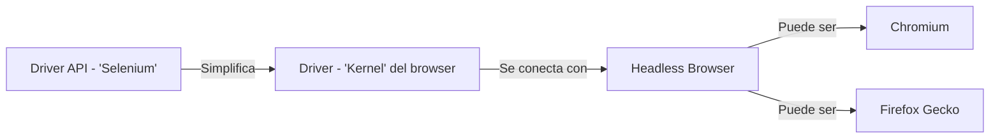

# girls4stem

[https://girls4stem.uv.es/#/expertaStem#expertsCards](https://girls4stem.uv.es/#/expertaStem#expertsCards)

Parte de la sesión [Web Scraping y las Bases de Datos Ofuscadas](https://github.com/jofaval/talks-about/tree/master/uv/web-scraping-y-las-bases-de-datos-ofuscadas)

## Tabla de contenido

1. [Taller](#taller)
   1. [Hay qué](#hay-qué)
   1. [Configuración](#configuración)
1. [Selenium](#selenium)
   1. [Qué es](#qué-es)
   1. [Para qué sirve](#para-qué-sirve)
   1. [Arquitectura](#arquitectura)
1. [Alternativas a Selenium](#alternativas-a-selenium)
   1. [Scrapy](#scrapy)
      1. [Enlace oficial](#enlace-oficial)
      1. [Pros](#pros-1)
      1. [Contras](#contras)
      1. [Snippet](#snippet)
   1. [Puppeteer](#puppeteer)
      1. [Enlace oficial](#enlace-oficial-1)
      1. [Pros](#pros-1)
      1. [Contras](#contras-1)
      1. [Snippet](#snippet-1)
   1. [Cypress](#cypress)
      1. [Enlace oficial](#enlace-oficial-2)
      1. [Pros](#pros-2)
      1. [Contras](#contras-2)
      1. [Snippet](#snippet-2)
   1. [Playwright](#playwright)
      1. [Enlace oficial](#enlace-oficial-3)
      1. [Pros](#pros-3)
      1. [Contras](#contras-3)
      1. [Snippet](#snippet-3)

## Taller

[Tabla de contenido](#tabla-de-contenido)

### Hay qué

[Taller](#taller)

- Extraer información de todas las expertas de girls4stem
- Insertar la información siguiendo una estructura de datos razonable
- Realizar las consultas descritas

### Configuración

[Taller](#taller)

```
mvn clean install
```

Tras la instalación, Selenium debería estar listo para su uso

### Uso

```
mvn clean package exec:java
```

### Testing

```
mvn package test
```

## Selenium

[Tabla de contenido](#tabla-de-contenido)

Documentación oficial:

[https://www.selenium.dev/documentation/](https://www.selenium.dev/documentation/)

### Qué es

[Selenium](#selenium)

Headless browser con una interfaz para la comunicación entre navegadores.\
Es decir, es la suite completa de librería + driver api para poder automatizar acciones con navegadores

### Para qué sirve

[Selenium](#selenium)

- Testing automático y e2e
- Automatizar procesos rutinarios (fichar en plataformas, iniciar sesión, etc.)
- Web scraping

### Arquitectura

[Selenium](#selenium)



1. La API es dependiente del lenguaje que se esté utilizando
   - La librería podrá cambiar sintaxis aún manteniendo conceptos
   - El funcionamiento será muy parecido, pero con las peculiaridades de cada lenguaje (Python GIL, Java JVM)
1. El driver es la conexión específica de la librería con el headless browser, es el elemento común
   - Java usa un JVM para proporcionar un lenguaje unificado sin importar el Sistema Operativo
   - Selenium tiene un driver que se conectará con cada navegador (o "será" el navegador)
1. Headless Browser, el _flavor_ del navegador tiene diferencias y soportes, user-agents diferentes, motores diferentes
   - Teniendo un elemento que unifica conceptos (driver) y una librería que permite comunicarse en varios lenguajes, puede ser que necesitemos diferentes navegadores, ahí entran los navegadores que queramos usar
   - Google Chrome usa el motor de Chromium (y la mayoría de los navegadores también), Firefox tiene su propio motor (Gecko), y Safari también (WebKit)

## Alternativas a Selenium

[Tabla de contenido](#tabla-de-contenido)

No es la única opción del mercado, pero sí la más conocida.\
Y agnóstica hasta cierto punto con respecto al lenguaje necesario

El código que se muestra es de **ejemplo**. ¡¡No va a funcionar!!

### Scrapy

[Alternativas a Selenium](#alternativas-a-selenium)

#### Enlace oficial

[Scrapy](#scrapy)

https://scrapy.org/

#### Pros

[Scrapy](#scrapy)

- Usa Python, es decir, se puede usar en Google Colab sin mayor inconveniente
- Es una librería de utilidades, no un driver, por lo que la instalación y configuración es relativamente sencilla
- Está preparada específicamente para web scraping

#### Contras

[Scrapy](#scrapy)

- Requiere clases, lo cuál no es malo por defecto, pero cuando es una imposición, y más en Python que no todo son clases, es un gomet negativo
- Las configuraciones van ligadas a archivos físicos (a veces), por lo que ni puede ser un único notebook, ni un único fichero de script
- Toda librería abstrae, pero toda abstracción siempre tiene una fuga

#### Snippet

[Scrapy](#scrapy)

Directo de la documentación

```python
import scrapy

class BlogSpider(scrapy.Spider):
    name = 'blogspider'
    start_urls = ['https://www.zyte.com/blog/']

    def parse(self, response):
        for title in response.css('.oxy-post-title'):
            yield {'title': title.css('::text').get()}

        for next_page in response.css('a.next'):
            yield response.follow(next_page, self.parse)

EOF
```

### Puppeteer

[Alternativas a Selenium](#alternativas-a-selenium)

#### Enlace oficial

[Puppeteer](#puppeteer)

https://pptr.dev/

#### Pros

[Puppeteer](#puppeteer)

- Usa JavaScript y Node por lo que hay un montón de documentación de lenguaje (y utilidades de alto nive, MapReduce por ejemplo)
- Usar JavaScript ofrece una integración con el DOM más cercana
- Es un headless browser, está pensado para testing e2e (similar a Selenium)

#### Contras

[Puppeteer](#puppeteer)

- JavaScript no es perfecto, ni el lenguaje más rápido, además, necesita de TypeScript para añadir tipados
- Requiere de Node para poder funcionar, y aunque Node sea útil, también es problemático a ratos
- Está pensado para testing, por lo que toda integración para web scraping se crea _ad hoc_

#### Snippet

[Puppeteer](#puppeteer)

Modificado de la documentación

```javascript
import puppeteer from "puppeteer";

(async () => {
  const browser = await puppeteer.launch();
  const page = await browser.newPage();

  await page.goto("https://developer.chrome.com/");

  await page.waitForSelector(".devsite-result-item-link");
  await page.click(searchResultSelector);

  const fullTitle = await textSelector?.evaluate((el) => el.textContent);

  await browser.close();
})();
```

### Cypress

[Alternativas a Selenium](#alternativas-a-selenium)

#### Enlace oficial

[Cypress](#cypress)

https://www.cypress.io/

#### Pros

[Cypress](#cypress)

- JavaScript + Node, más cerca del DOM
- No está pensado para web scraping, pero tiene utilidades de DOM (que nos vienen bien
- Muy reconocido dentro del ecosistema de Node
- API bastante simple

#### Contras

[Cypress](#cypress)

- JavaScript no es perfecto, ni el lenguaje más rápido, además, necesita de TypeScript para añadir tipados
- Requiere de Node para poder funcionar, y aunque Node sea útil, también es problemático a ratos
- Está pensado para testing, por lo que toda integración para web scraping se crea _ad hoc_

#### Snippet

[Cypress](#cypress)

```javascript
cy.visit("http://localhost:8080");
const element = cy.contains("querySelector");
element.contains("a").click();
```

### Playwright

[Alternativas a Selenium](#alternativas-a-selenium)

#### Enlace oficial

[Playwright](#playwright)

https://playwright.dev/

#### Pros

[Playwright](#playwright)

- JavaScript + Node, más cerca del DOM
- No está pensado para web scraping, pero tiene utilidades de DOM (que nos vienen bien)
- Playwright es parecido a Cypress, pero con mayor rendimiento

#### Contras

[Playwright](#playwright)

- JavaScript no es perfecto, ni el lenguaje más rápido, además, necesita de TypeScript para añadir tipados
- Requiere de Node para poder funcionar, y aunque Node sea útil, también es problemático a ratos
- Está pensado para testing, por lo que toda integración para web scraping se crea _ad hoc_
- La sintáxis es un poco más enrevesada que la de Cypress

#### Snippet

[Playwright](#playwright)

Directo de la documentación

```javascript
import { test, expect } from "@playwright/test";

test("has title", async ({ page }) => {
  await page.goto("https://playwright.dev/");

  await expect(page).toHaveTitle(/Playwright/);
});

test("get started link", async ({ page }) => {
  await page.goto("https://playwright.dev/");

  await page.getByRole("link", { name: "Get started" }).click();

  await expect(
    page.getByRole("heading", { name: "Installation" })
  ).toBeVisible();
});
```
