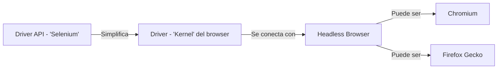

# girls4stem

[https://girls4stem.uv.es/#/expertaStem#expertsCards](https://girls4stem.uv.es/#/expertaStem#expertsCards)

## Tabla de contenido

1. [Selenium](#selenium)
   1. [Qué es](#qué-es)
   1. [Para qué sirve](#para-qué-sirve)
   1. [Arquitectura](#arquitectura)
1. [Taller](#taller)
   1. [Hay qué](#hay-qué)
   1. [Configuración](#configuración)

## Selenium

[Tabla de contenido](#tabla-de-contenido)

Documentación oficial:

[https://www.selenium.dev/documentation/](https://www.selenium.dev/documentation/)

### Qué es

[Selenium](#selenium)

Headless browser con una interfaz para la comunicación entre navegadores.\
Es decir, es la suite completa de librería + driver api para poder automatizar acciones con navegadores

### Para qué sirve

[Selenium](#selenium)

- Testing automático y e2e
- Automatizar procesos rutinarios (fichar en plataformas, iniciar sesión, etc.)
- Web scraping

### Arquitectura

[Selenium](#selenium)



1. La API es dependiente del lenguaje que se esté utilizando
   - La librería podrá cambiar sintaxis aún manteniendo conceptos
   - El funcionamiento será muy parecido, pero con las peculiaridades de cada lenguaje (Python GIL, Java JVM)
1. El driver es la conexión específica de la librería con el headless browser, es el elemento común
   - Java usa un JVM para proporcionar un lenguaje unificado sin importar el Sistema Operativo
   - Selenium tiene un driver que se conectará con cada navegador (o "será" el navegador)
1. Headless Browser, el _flavor_ del navegador tiene diferencias y soportes, user-agents diferentes, motores diferentes
   - Teniendo un elemento que unifica conceptos (driver) y una librería que permite comunicarse en varios lenguajes, puede ser que necesitemos diferentes navegadores, ahí entran los navegadores que queramos usar
   - Google Chrome usa el motor de Chromium (y la mayoría de los navegadores también), Firefox tiene su propio motor (Gecko), y Safari también (WebKit)

## Taller

[Tabla de contenido](#tabla-de-contenido)

### Hay qué

[Taller](#taller)

- Extraer información de todas las expertas de girls4stem
- Insertar la información siguiendo una estructura de datos razonable
- Realizar las consultas descritas

### Configuración

[Taller](#taller)

```
maven install
```

Tras la instalación, Selenium debería estar listo para su uso
